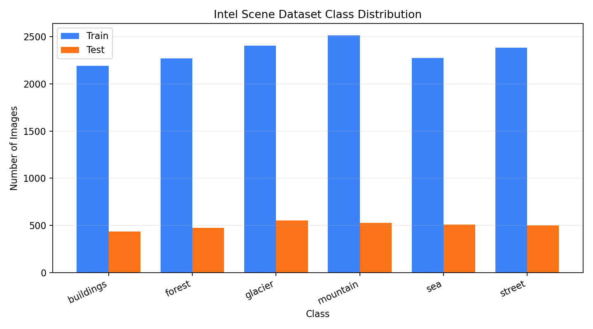
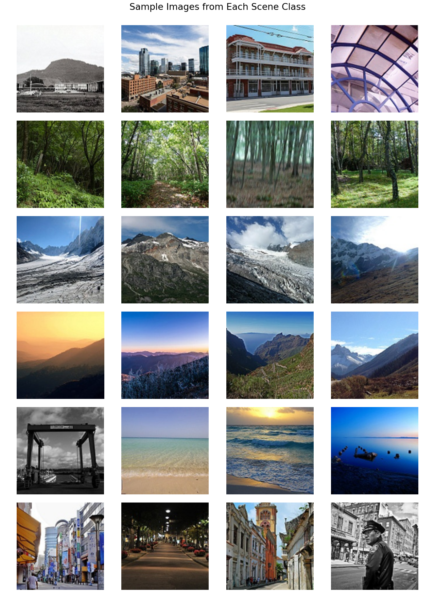
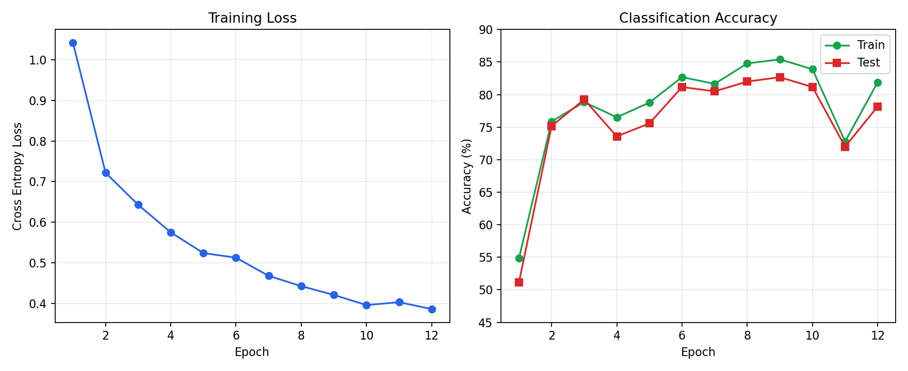

# 第六次作业报告

## 一、ParallelModule 并行模块

本次实验使用 Rust 和 `tch-rs` 实现。`ParallelModule` 接收两个子模块 `net1` 和 `net2`，二者都实现 `tch::nn::Module`。前向传播时，同一个输入会分别送入两个子模块，然后将两个输出在特征维度上拼接：

```rust
impl<N1, N2> Module for ParallelModule<N1, N2>
where
    N1: Module,
    N2: Module,
{
    fn forward(&self, xs: &Tensor) -> Tensor {
        Tensor::cat(&[self.net1.forward(xs), self.net2.forward(xs)], 1)
    }
}
```

实验中令输入为 `2 x 4` 的随机张量，`net1` 输出维度为 3，`net2` 输出维度为 2。因此拼接后输出维度为 `2 x 5`。本次使用 ROCm GPU 运行，输出张量类型为 `CUDAFloatType`。

运行结果摘录：

```text
随机输入 x shape = [2, 4]
-1.2682 -0.0383 -0.1029  1.4400
-0.4705  1.1624  0.3058  0.5276
[ CUDAFloatType{2,4} ]

拼接输出 y shape = [2, 5]
-1.3050  0.0280 -0.9519 -1.1610  0.8372
-1.4306  0.3625  0.1063 -1.6968  0.7576
[ CUDAFloatType{2,5} ]
```

这说明并行模块能够同时保留两个子网络提取到的不同特征，并在后续网络中统一使用。

## 二、共享参数层的多层感知机

共享参数 MLP 的结构如下：

```text
input linear -> ReLU -> shared linear -> ReLU -> shared linear -> ReLU -> output linear
```

其中 `shared` 层只创建一次，但在前向传播中被调用两次：

```rust
let h2 = h1.apply(&self.shared).relu();
let h3 = h2.apply(&self.shared).relu();
```

因此，`shared` 层只有一组权重和偏置。反向传播时，这一组参数会同时接收两次使用位置产生的梯度贡献。

本实验使用合成回归数据训练模型。每轮训练中先执行 `loss.backward()`，然后观察各层参数均值和梯度范数，最后执行优化器更新。

运行结果摘录：

```text
epoch 01: loss=13.408348; input.w mean=0.1503, shared.w mean=-0.0382, output.w mean=-0.0303; input.w grad_norm=2.6147, shared.w grad_norm=8.4337, output.w grad_norm=3.4421
epoch 04: loss=3.230575; input.w mean=0.1461, shared.w mean=-0.0109, output.w mean=0.0085; input.w grad_norm=2.2408, shared.w grad_norm=3.6126, output.w grad_norm=2.7640
epoch 08: loss=0.906722; input.w mean=0.1373, shared.w mean=0.0039, output.w mean=0.0555; input.w grad_norm=1.5499, shared.w grad_norm=1.5972, output.w grad_norm=1.0541
```

可以看到 loss 从 `13.408348` 下降到 `0.906722`，说明模型参数被正常训练；同时 `shared.w` 的参数和梯度每轮都能被观察到，验证了共享层参与了反向传播。

运行方式：

```bash
cd /home/hugo/codes/d2l_homework/d2l6
./scripts/run_with_rocm.sh
```

## 三、计算题

### 1. 三层全连接神经网络参数量

题目条件：

- 输入层节点数：3
- 隐藏层节点数：4
- 输出层节点数：1
- 每个神经元都有偏置项
- 隐藏层和输出层都使用 sigmoid 激活函数

输入层到隐藏层：

```text
权重参数 = 3 x 4 = 12
偏置参数 = 4
```

隐藏层到输出层：

```text
权重参数 = 4 x 1 = 4
偏置参数 = 1
```

总参数量：

```text
12 + 4 + 4 + 1 = 21
```

答案：这个神经网络需要训练 21 个参数。

### 2. 卷积层输出大小和参数量

题目条件：

- 输入大小：`11 x 11 x 3`
- 卷积核大小：`5 x 5`
- 步幅：2
- 填充：0
- 输出通道数：10

输出高和宽计算公式：

```text
out = floor((input + 2 * padding - kernel_size) / stride) + 1
```

代入：

```text
out = floor((11 + 2 * 0 - 5) / 2) + 1
    = floor(6 / 2) + 1
    = 4
```

因此输出特征图大小为：

```text
4 x 4 x 10
```

每个卷积核的参数量：

```text
5 x 5 x 3 + 1 = 76
```

10 个输出通道对应 10 个卷积核：

```text
76 x 10 = 760
```

答案：当前层输出特征映射大小为 `4 x 4 x 10`，需要学习 760 个参数。

### 3. 平均池化层输出大小和参数量

题目条件：

- 输入大小：`11 x 11 x 3`
- 平均池化核大小：2
- 步长：1
- 默认填充：0

输出高和宽：

```text
out = floor((11 - 2) / 1) + 1 = 10
```

池化层不会改变通道数，因此输出大小为：

```text
10 x 10 x 3
```

平均池化层没有可学习权重和偏置。

答案：当前层输出特征图大小为 `10 x 10 x 3`，需要学习 0 个参数。

## 四、场景分类 CNN 设计与实验

本次补充使用 Intel Image Classification 场景分类数据集。数据已经下载到：

```text
data/intel-scenes/
  seg_train/seg_train/
  seg_test/seg_test/
```

数据集包含 6 个场景类别：

```text
buildings, forest, glacier, mountain, sea, street
```

各类别图片数量如下：

```text
训练集:
buildings 2191
forest    2271
glacier   2404
mountain  2512
sea       2274
street    2382

测试集:
buildings 437
forest    474
glacier   553
mountain  525
sea       510
street    501
```

数据可视化结果如下。由于中文字体在当前绘图环境中容易乱码，图中的标题、坐标轴、图例和类别名称均使用英文。





本实验在 AMD ROCm GPU 上运行。由于 Rust `tch-rs` 默认受系统环境变量影响会链接到 CPU 版 `/opt/libtorch`，本项目使用脚本 `scripts/run_with_rocm.sh` 预加载 ROCm 版 PyTorch 动态库：

```bash
./scripts/run_with_rocm.sh
```

程序运行时确认设备如下：

```text
使用设备: Cuda(0), CUDA/ROCm 可用: true, 设备数: 2
```

`rocm-smi` 观察到 GPU[0] 使用率达到 `99% - 100%`，说明训练确实在显卡上执行。

本实验每个类别抽取 800 张训练图片、200 张测试图片，并统一缩放到 `96 x 96`。模型结构如下：

```text
输入: 3 x 96 x 96

卷积块 1:
Conv2d(3 -> 32, kernel=3, padding=1, bias=false)
BatchNorm2d(32)
ReLU
Conv2d(32 -> 32, kernel=3, padding=1, bias=false)
BatchNorm2d(32)
ReLU
MaxPool2d(kernel=2)
输出: 32 x 48 x 48

卷积块 2:
Conv2d(32 -> 64, kernel=3, padding=1, bias=false)
BatchNorm2d(64)
ReLU
Conv2d(64 -> 64, kernel=3, padding=1, bias=false)
BatchNorm2d(64)
ReLU
MaxPool2d(kernel=2)
输出: 64 x 24 x 24

卷积块 3:
Conv2d(64 -> 128, kernel=3, padding=1, bias=false)
BatchNorm2d(128)
ReLU
Conv2d(128 -> 128, kernel=3, padding=1, bias=false)
BatchNorm2d(128)
ReLU
MaxPool2d(kernel=2)
输出: 128 x 12 x 12

卷积块 4:
Conv2d(128 -> 256, kernel=3, padding=1, bias=false)
BatchNorm2d(256)
ReLU
Conv2d(256 -> 256, kernel=3, padding=1, bias=false)
BatchNorm2d(256)
ReLU
MaxPool2d(kernel=2)
输出: 256 x 6 x 6

分类器:
AdaptiveAvgPool2d(1 x 1)
Flatten
Dropout(0.4)
Linear(256 -> 6)
```

模型可训练参数量为 1174758。损失函数使用交叉熵损失：

```text
loss = cross_entropy(logits, labels)
```

优化器使用 AdamW，学习率为 `1e-3`，训练 12 轮。训练过程中对训练 batch 使用随机水平翻转和随机裁剪作为数据增强。

训练结果如下：

```text
训练样本: 4800, 测试样本: 1200
epoch 01: loss=1.0418, train_acc=54.85%, test_acc=51.17%
epoch 02: loss=0.7217, train_acc=75.88%, test_acc=75.17%
epoch 03: loss=0.6429, train_acc=78.85%, test_acc=79.25%
epoch 04: loss=0.5749, train_acc=76.52%, test_acc=73.58%
epoch 05: loss=0.5240, train_acc=78.77%, test_acc=75.58%
epoch 06: loss=0.5127, train_acc=82.69%, test_acc=81.17%
epoch 07: loss=0.4679, train_acc=81.65%, test_acc=80.50%
epoch 08: loss=0.4426, train_acc=84.79%, test_acc=82.00%
epoch 09: loss=0.4209, train_acc=85.42%, test_acc=82.67%
epoch 10: loss=0.3960, train_acc=83.90%, test_acc=81.17%
epoch 11: loss=0.4030, train_acc=72.79%, test_acc=72.00%
epoch 12: loss=0.3862, train_acc=81.90%, test_acc=78.17%
```

训练过程可视化如下：



可以看到，模型从随机水平约 `16.67%` 提升到最高 `82.67%` 的测试准确率。第 9 轮之后准确率有波动，说明继续训练时需要更细致地调整学习率，或保存验证集上表现最好的模型。整体上，该 CNN 已经能有效区分建筑、森林、冰川、山地、海洋和街道等场景类别。
